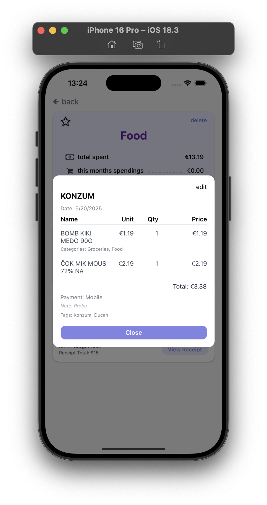

# FinTrack - Finance Tracking Application (Frontend)

Mobile application for personal expense tracking: receipt scanning (OCR), manual entry, categorization, and analytics.  
This repository contains the **client-side** built with **React Native**, **Expo**, and **Expo Router**.

---

## ✨ Features

- Onboarding, registration, and login (JWT-based)
- Scan receipts via camera or import from gallery (OCR handled by backend)
- Manual receipt entry and editing
- Categorization of expenses and “favorite” categories
- Receipt history with filtering, sorting, and pagination
- Analytics: monthly summaries, average receipt value, spending by category and store

---

## 🧰 Tech Stack

- **React Native** (Expo)
- **Expo Router** (navigation)
- **Axios** (HTTP requests) + **AsyncStorage** (local token storage)
- **react-native-chart-kit**, **react-native-svg** (charts)
- **react-native-progress**, RN **Animated** (UI & animations)

---

## 📦 Project Structure

- **app/** → Navigation and main screens (Expo Router)  
- **components/** → Reusable UI building blocks (charts, buttons, modals, menus, etc.)  
- **services/** → Centralized API communication (Axios client + domain services)  
- **utils/** → General helper functions  
- **assets/** → Static resources (icons, images, illustrations) 

---

## 🔐 Authentication

- Backend returns a JWT after successful registration/login.
- Token is stored in AsyncStorage.
- Interceptor in apiClient.ts automatically adds Authorization: Bearer <token> to all protected requests.

## 📊 Analytics

- Monthly Spending, Average Receipt Value
- Spendings of Last 4 Months (bar chart)
- Spending Overview by Category & Spending by Store (pie charts)

## 📷 Screenshots

### Onboarding Flow

  

### Sign Up / Log In

  
   

### Home Screen

   

### Profile 

  
   

### Analytics 

   

### New Receipt 

  
  

  
  
  

### Categories Screen

  
  
  

    
  
  
  
  
  

